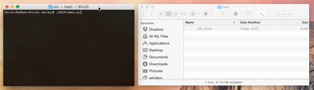

# Hot Folders Converter

A sample Python application which uses the [Zamzar Developer API](https://developers.zamzar.com/) to automatically convert files in user-specified folders into different formats.

Use the app to monitor "hot" folders, and perform background conversions of (say) Word documents into PDF's, 7z archive files into ZIP's and PNG's into JPG's.

This code is aimed at developers interested in using the Zamzar file conversion API. If you find any issues please raise them against this repository, since it is monitored by the Zamzar development team. We welcome pull requests, forks and suggestions for improvements.

This code is licensed under the [MIT License](License) - we encourage you to take this code and develop on top of it.

Check it out:

## Assumptions

We assume that you are either:

* Comfortable running Python programs (if you just wish to run this application)

*or*

* A developer with some experience using Python (if you wish to extend this application)

## Dependencies

* Python 3.x
* Various libraries:
    * Watchdog
    * Requests
    * JSON
    * HTTPBasicAuth
    * Time
    * os
    * zipfile

## Getting Started

To get started with this project:

### Clone this repository:

    git clone https://github.com/zamzar/zamzar-samples-hotfolders

### Check your Python version

This application requires Python 3.x - If you don't have it please install from [https://www.python.org/downloads/](https://www.python.org/downloads/)).

**NOTE:** On OS X (up to and including El Capitan) the default Python is v2 (v2.7 to be precise), so you will need to install Python 3. The [general consensus](http://stackoverflow.com/questions/18425379/how-to-set-pythons-default-version-to-3-3-on-os-x) is that you should not replace the v2 system default though - just run side-by-side.

### Install PIP

PIP (a Python package manager) is needed to install the Python libraries required for this application. If you don't have PIP it can be installed on Unix based systems using:

    curl https://bootstrap.pypa.io/get-pip.py | python3

Or on Windows by downloading and running this python file: [https://bootstrap.pypa.io/get-pip.py](https://bootstrap.pypa.io/get-pip.py)

**Note:** On OS X if you install Python v3 you will get pip3 installed too.

### Install Libraries

Use PIP to install `Watchdog` and `Requests` by running this on UNIX or Windows:

    pip install "Watchdog>0.8.2"
    pip install "Requests>2.9.2"

On OS X you should explicitly run `pip3`:

    pip3 install "Watchdog>0.8.2"
    pip3 install "Requests>2.9.2"

### Obtain a Zamzar API key

This program uses the [Zamzar file conversion API](https://developers.zamzar.com/) to perform file conversions. Because of this, a Zamzar account and API key are required to use it. To get an API key:

1. Go to [https://developers.zamzar.com/pricing](https://developers.zamzar.com/pricing)
2. Choose whatever plan fulfills your needs and click the corresponding 'Sign Up' button.
3. Fill in your credentials, agree to the terms & privacy policy, and click the continue button.
4. You will now be taken to your account dashboard, where you can see your plan and API Key.
5. Copy the API key from your account dashboard.
6. Add the API key to the `api_key` block of the `hotfolders_config.json` configuration file.

## Configuration

### Edit the config file

To tell the application what directories we wish to monitor for files, and what formats to convert into we use a configuration file called `hotfolders_config.json`, which can be edited to your needs.

The `hotfolders_config.json` file must have an `api_key` specified in order to use the Zamzar API. You can edit the `hotfolders_config.json` file to define the folders to watch and specify which automatic conversions to perform. There are also 2 option switches for each folder:

* **autodelete** - Should the application automatically delete source files after conversion (`1`) or not (`0`)
* **autoextractzip** - If .zip files are deteced should the application automatically extract them (`1`) or not (`0`)
* **subdirsearch** - Should the application recurse down through subdirectories to look for files (`1`) or not (`0`)

The format for creating a folder to watch is:

    "/Users/ME/MyFolder": {
          "from": [
            "7z",
            "rar",
            "tar"
          ],
          "to": [
            "zip",
            "docx"
	        ],
          "options": {
            "autodelete": 1,
            "autoextractzip": 0,
            "subdirsearch": 1
          }
    }

A full list of support "from" and "to" file formats can be found at [https://developers.zamzar.com/formats](https://developers.zamzar.com/formats)

## Running the program

To run the program, drop in to a terminal or command prompt and run:

    python HotFolders.py
